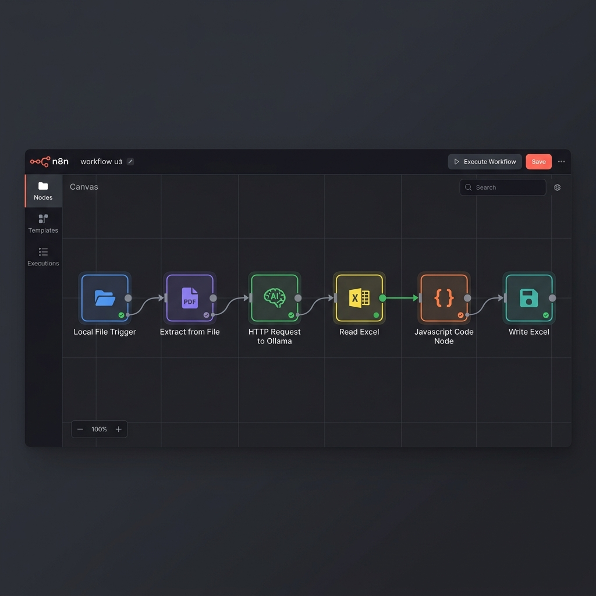
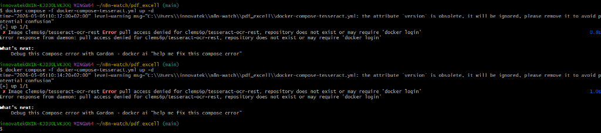

# 📑 Sistema de Extracción de Facturas con IA (100% Local y Privado)

Este repositorio contiene la solución definitiva para la automatización de facturas de **Medios y Transportes Goiherri SL**. A diferencia de las soluciones comerciales, este sistema procesa los documentos en un entorno "Air-Gapped" (sin salida a internet), garantizando el cumplimiento de la RGPD y la seguridad total de los datos financieros.



---

## 🧐 Análisis Profundo del Funcionamiento

### 1. Detección Inteligente (Local File Trigger)
El flujo comienza vigilando la carpeta `entrada_facturas_pdf`. 
- **Tecnología**: Utilizamos el nodo `Local File Trigger` con la opción de **Polling** activada. 
- **¿Por qué?**: En entornos Docker sobre Windows, los eventos del sistema de archivos a veces no se transmiten correctamente. El *polling* asegura que cada 5-10 segundos n8n compruebe manualmente si hay archivos nuevos, garantizando un 100% de fiabilidad en la detección.

### 2. Dualidad de Procesamiento (PDF vs OCR)
No todas las facturas son iguales. El sistema implementa una lógica de bifurcación:
- **Facturas Digitales**: Si el PDF contiene texto incrustado (capas de texto), el sistema lo extrae en milisegundos usando el motor de n8n.
- **Facturas Escaneadas (OCR)**: Si el archivo es una imagen o un PDF "vacío" de texto, se redirige automáticamente al motor de **Paperless-ngx**.
    - **Proceso**: Se envía el binario a la API local de Paperless (`http://paperless_webserver:8000`).
    - **Espera**: El flujo espera 10 segundos mientras los hilos de Tesseract en el contenedor procesan la imagen para convertirla en texto editable.

### 3. El Cerebro: Ollama + Llama 3.2
Una vez obtenido el texto plano, entra en juego la Inteligencia Artificial Generativa local.
- **Modelo**: `llama3.2` (seleccionado por su excelente equilibrio entre velocidad y comprensión de tablas).
- **Prompt Engineering**: Se ha diseñado un prompt que fuerza a la IA a devolver un JSON estricto. La IA identifica:
    - Datos del Emisor (CIF, Nombre, Dirección).
    - Datos del Receptor.
    - Conceptos de factura, bases imponibles e IVAs.
- **Ventaja Local**: Al procesar en local, no hay latencia de red y el coste por factura es cero.

### 4. Inyección en Excel (XML Spreadsheet 2003)
En lugar de generar un archivo CSV simple que da problemas con tildes y formatos, usamos un estándar de Excel profesional.


- **Lógica de Inyección**: El nodo de código JavaScript lee el archivo `.xls` actual y busca la etiqueta de cierre `</Table>`. Justo antes de esa etiqueta, inyecta una nueva fila estructurada en XML.
- **Guardarraíles de Datos**: El código incluye lógica para:
    - **Intercambio de Fechas/Números**: Si la IA se confunde y pone la fecha en el número de factura, el código detecta el patrón y lo corrige.
    - **Limpieza de Caracteres**: Se eliminan símbolos que podrían romper el formato XML (uso de la función `esc()`).

---

## 🛠️ Componentes de la Infraestructura Docker

El sistema se levanta mediante microservicios coordinados. Puedes ver su estado de salud aquí:



- **Container `n8n`**: Orquestador principal.
- **Container `paperless_webserver`**: Motor de OCR (Tesseract).
- **Container `ollama`**: Servidor de Inferencia de IA.
- **Container `paperless_db` / `redis`**: Persistencia y caché para el motor de OCR.

---

## 🚀 Guía de Despliegue Paso a Paso

### 1. Preparación del Entorno
Descarga el modelo de visión/lenguaje en tu terminal de Docker:
```bash
docker exec -it ollama ollama pull llama3.2
```

### 2. Arranque del Sistema
Desde la carpeta raíz del proyecto en Git Bash:
```bash
docker compose -f docker-compose-paperless.yml up -d
```

### 3. Importación del Flujo
Carga el archivo `email_pdf_excell.json` en tu interfaz de n8n. Verás que todos los nodos ya están configurados para hablar entre sí usando las DNS internas de Docker (ej: `http://paperless_webserver`).

---

## 🔒 Privacidad y Soberanía de Datos
Este proyecto demuestra que no es necesario enviar datos sensibles a la nube (OpenAI, Google, etc.) para tener una automatización inteligente. Al mantener todo en el servidor local de **Medios y Transportes Goiherri SL**, se asegura la máxima protección contra filtraciones y se cumple con los más altos estándares de seguridad informática.

---
*Documentación actualizada Mayo 2026*