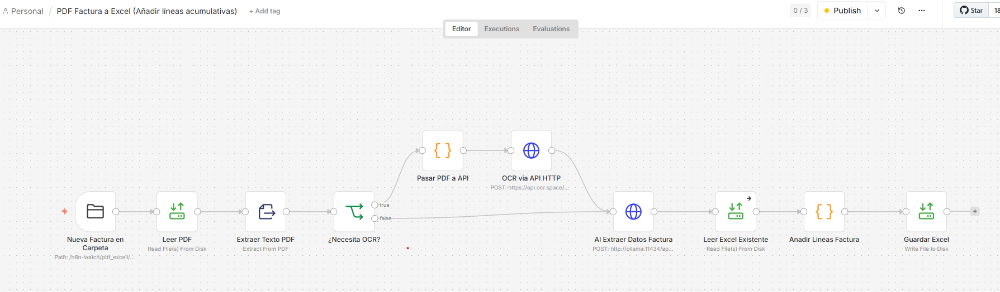
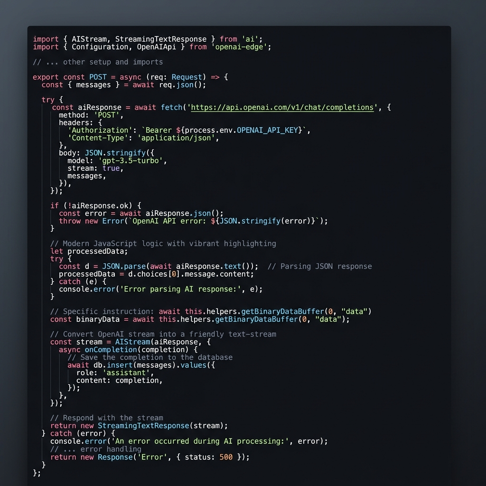

# Documentación del Proyecto: Automatización de Facturas a Excel (n8n + Ollama)

Este documento detalla la arquitectura, configuración y funcionamiento del sistema automatizado para extraer datos de facturas en PDF y volcarlas de forma acumulativa en un archivo Excel maestro.

---

## 1\. Arquitectura del Workflow (`email_pdf_excell.json`)

El flujo está diseñado para ser **indestructible**. Utiliza una lógica que permite crear el archivo desde cero si no existe o añadir filas si ya contiene datos, evitando duplicados o sobrescrituras accidentales.

### Detalle de los Nodos

#### 1\. Local File Trigger (Nueva Factura)

-   **Función:** Detecta la adición de nuevos archivos PDF en la carpeta `entrada_facturas_pdf`.
-   **Configuración:** Utiliza *polling* y la opción `awaitWriteFinish` para asegurar que el archivo se ha copiado completamente antes de procesarlo.

#### 2\. Leer PDF & Extraer Texto

-   **Función:** Convierte el archivo binario en texto plano.
-   **Optimización:** Si el PDF es una imagen (escaneado), el flujo incluye una rama de **OCR vía API** para asegurar que siempre haya texto para la IA.

#### 3\. AI Extraer Datos Factura (Ollama)

-   **Modelo:** `llama3.2` configurado en formato JSON.
-   **Resultado:** Extrae campos críticos (CIF, Totales, Fechas, Líneas de detalle) de forma estructurada.

#### 4\. Leer Excel Existente

-   **Configuración Clave:**
    -   `On Error -> Continue (using regular output)`.
    -   **Por qué:** Al eliminar la salida de “Error”, permitimos que el flujo continúe hacia el nodo de código incluso si es la primera vez que se ejecuta y el archivo aún no existe. Esto evita que el proceso se detenga.

#### 5\. Añadir Líneas Factura (Code Node - El Cerebro)

Este nodo realiza la magia de la persistencia. Utiliza un sistema de inyección XML para añadir datos sin corromper el formato de Excel.

-   **Lógica de Robustez:**
    1.  **Lectura Segura:** Usa `this.helpers.getBinaryDataBuffer` para acceder al contenido real del Excel en memoria.
    2.  **Detección de Tabla:** Busca la etiqueta de cierre `</Table>` del formato SpreadsheetML de Excel.
    3.  **Append vs Create:** Si encuentra la tabla, inserta la nueva fila (`<Row>`) justo antes del final. Si no la encuentra, genera toda la estructura XML (cabeceras y estilos) desde cero.

#### 6\. Guardar Excel

-   **Función:** Escribe el resultado final en el disco, sobrescribiendo el archivo maestro con la nueva versión que ya incluye la factura procesada.

---

## 2\. Configuración Técnica y Permisos

### Docker y Volúmenes

El entorno depende de un montaje correcto entre Windows y el contenedor Linux de n8n:

-   **Ruta Windows:** `c:\Users\innovatek\n8n-watch\pdf_excell`
-   **Ruta n8n (Interna):** `/data/pdf_excell/`
-   **Variable Vital:** `N8N_ENFORCE_SETTINGS_FILE_PERMISSIONS=false`. Esta variable permite que n8n escriba en carpetas compartidas de Windows sin errores de permisos de usuario.

### Estilos y Formato

El archivo generado es un `.xls` basado en XML (SpreadsheetML). Esto permite:

-   **Estilos Profesionales:** Cabeceras en azul oscuro con texto blanco y negrita.
-   **Auto-ajuste:** Columnas con anchos predefinidos para que los datos sean legibles al abrir el archivo.
-   **Compatibilidad:** Se abre perfectamente en Excel, LibreOffice y Google Sheets.

---

## 3\. Resolución de Problemas (FAQ)

**¿Por qué se sobrescribía el archivo antes?**  
Porque el nodo de código no lograba leer el archivo anterior debido a cambios en la gestión de binarios de n8n v1+. Al no leer nada, el script creía que el archivo era nuevo y lo creaba de cero cada vez. Ahora, con la lectura vía *Buffer*, el sistema es capaz de ver las facturas anteriores y añadir la nueva al final.

**¿Qué pasa si el Excel está abierto en mi PC?**  
Windows podría bloquear el archivo. Se recomienda cerrar el Excel mientras el workflow está procesando facturas para evitar errores de escritura (“Permission Denied”).